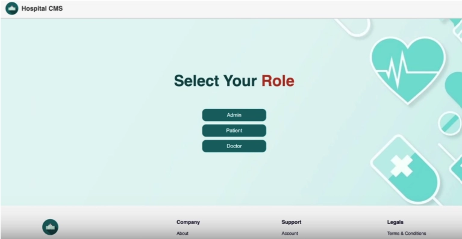
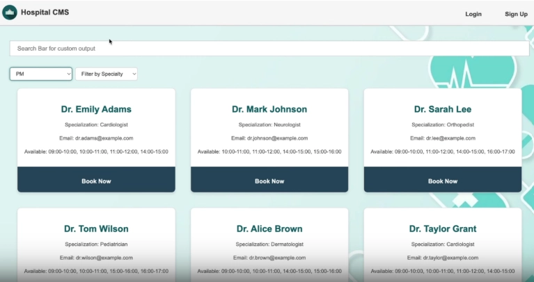
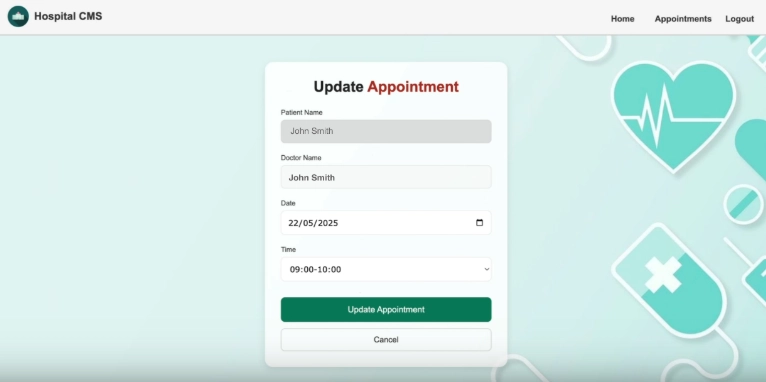
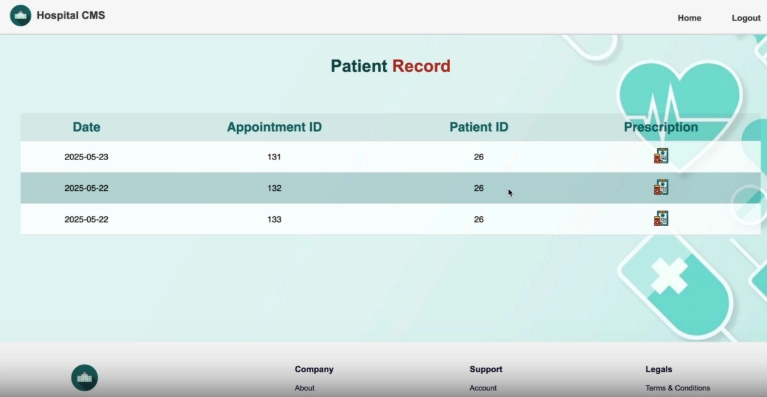
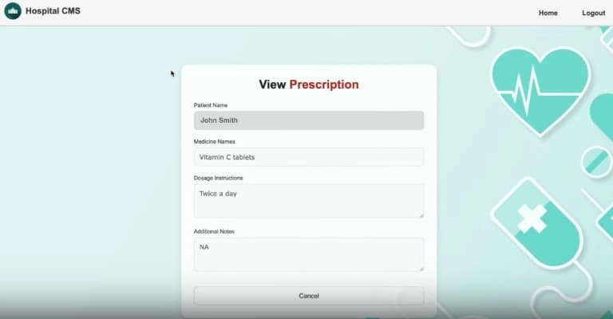

# Smart Clinic Management System Full-Stack App

This is the main project [Java Development Capstone Project](https://www.coursera.org/learn/java-development-capstone-project) from
[IBM Java Developer Professional Certificate Course](https://www.coursera.org/professional-certificates/java-developer?utm_medium=sem&utm_source=gg&utm_campaign=b2c_emea_x_multi_ftcof_career-academy_cx_dr_bau_gg_pmax_gc_s1_en_m_hyb_23-12_x&campaignid=20858198824&adgroupid=&device=c&keyword=&matchtype=&network=x&devicemodel=&creativeid=&assetgroupid=6490027433&targetid=&extensionid=&placement=&gad_source=1&gad_campaignid=20854471652&gbraid=0AAAAADdKX6YGhytr_SEvqUWxmQBDfqUQ5&gclid=CjwKCAiAzrbIBhA3EiwAUBaUdYPlMtMt3J_mIsUu1E_BBc7aHIp0uzGBehVgjjHqww8CZbBqqNvtfBoCXeUQAvD_BwE)
and was created using [okssu-java-database-capstone-template](https://github.com/ibm-developer-skills-network/okssu-java-database-capstone-template) template.


This is a Spring Boot full-stack application following the MVC (Model–View–Controller) architectural pattern, providing both Thymeleaf templates and REST APIs. 
The app represents a robust Clinic Management System (CMS) with multiple capabilities for 3 different roles: admin, doctors and patients.
Some of the functionalities provided are: 
- CRUD operations for all entities depending on role. (ex. admin can add and modify doctor details)
- Advanced filtering depending on doctor availability (time-slots) and/or name and/or specialty.
- Role-specific permissions and restrictions

The application interacts with two databases (using JPA/Hibernate): a MySQL (for patient, doctor, appointment, and admin data) and a MongoDB (for prescriptions).

Since Spring MVC is used for this project, code is organized into three layers:

- Model: Data and business logic  
- View: UI or presentation layer  
- Controller: Handles input and orchestrates between Model and View

## General Project Info: 
- Big enumerated comment blocks in some project files are the initial code development instructions provided by the course.
- The central Service class in the backend, provides multiple functionalities such as: authentication, validation, and coordination across entities.
- The frontend part is structured by the project template and follows a rather "old-school" approach.
  However, it has been a very good opportunity to practice fundamental frontend coding skills.

### To run with docker:
1. Clone the repo (SSH)
    ```
    git clone git@github.com:CharioMich/java-database-capstone.git
    ```
2. Go to project directory
    ```
    cd java-capstone/app
    ```
3. Build the image
    ```
    docker build -t smart-clinic-app .
    ```
4. Run the container
    ```
    docker run -p 8080:8080 smart-clinic-app
    ```


## Possible Improvements 
The project is developed under the course instructions, so any personal opinions regarding structure, logic or design are limited.
Below I am stating some things I would personally implement differently:
- Common responses among methods. Some return zeros and ones while others true or false
- Implementation of Mapper class to map entities to DTOs and vice versa
- More robust role checking. Current one is fragile and introduces potential security issues
- Spring security implementation & Password encoding
- Access Token to be transferred via the headers and not in the url.
- Use of Lombok annotations for reducing boilerplate code
- Separation of validation logic into a validator class
- Global error handling
- Records as DTOs

## Resources / Front-End Project Structure

```declarative
app/src/main/resources
├── application.properties
├── static
│   ├── index.html
│   ├── assets
│   │   ├── css
│   │   │   ├── addPrescription.css
│   │   │   ├── adminDashboard.css
│   │   │   ├── doctorDashboard.css
│   │   │   ├── index.css
│   │   │   ├── patientDashboard.css
│   │   │   ├── style.css
│   │   │   └── updateAppointment.css
│   │   └── images
│   │       ├── addPrescriptionIcon
│   │       │   └── addPrescription.png
│   │       ├── edit
│   │       │   └── edit.png
│   │       ├── defineRole
│   │       │   └── index.png
│   │       └── logo
│   │           └── logo.png
│   ├── js
│   │   ├── components
│   │   │   ├── appointmentRow.js
│   │   │   ├── doctorCard.js
│   │   │   ├── footer.js
│   │   │   ├── header.js
│   │   │   ├── modals.js
│   │   │   ├── patientRecordRow.js
│   │   │   └── patientRows.js
│   │   ├── config
│   │   │   ├── config.js
│   │   ├── services
│   │   │   ├── appointmentRecordService.js
│   │   │   ├── doctorServices.js
│   │   │   ├── index.js
│   │   │   ├── patientServices.js
│   │   │   └── prescriptionServices.js
│   │   ├── addPrescription.js
│   │   ├── adminDashboard.js
│   │   ├── appointmentRecord.js
│   │   ├── doctorDashboard.js
│   │   ├── loggedPatient.js
│   │   ├── patientAppointment.js
│   │   ├── patientDashboard.js
│   │   ├── patientRecordServices.js
│   │   ├── render.js
│   │   ├── updateAppointment.js
│   │   └── util.js
│   └── pages
│       ├── addPrescription.html
│       ├── loggedPatientDashboard.html
│       ├── patientAppointments.html
│       ├── patientDashboard.html
│       ├── patientRecord.html
│       └── updateAppointment.html
└── templates
    ├── admin
    │   └── adminDashboard.html
    └── doctor
        └── doctorDashboard.html

```

## UI Screenshots

Entry point  
  
Search doctors  
  
Update appointment modal  
  
Patient records  
  
Prescription modal  
  

#### 🚧 Frontend requiring a few small fixes.

